# FitSmart AI — System Data Map

> **Generated:** 2026-04-15
> **Scope:** Every user-associated data point across all persistence layers
> **Layers covered:** Firestore (cloud), Drift/SQLite (local relational), SharedPreferences (local key-value)

---

## Table of Contents

1. [Data Architecture Overview](#1-data-architecture-overview)
2. [Layer 1 — Firestore (Cloud)](#2-layer-1--firestore-cloud)
3. [Layer 2 — Drift / SQLite (Local Relational)](#3-layer-2--drift--sqlite-local-relational)
4. [Layer 3 — SharedPreferences (Local Key-Value)](#4-layer-3--sharedpreferences-local-key-value)
5. [Core Data Models](#5-core-data-models)
6. [Complete Field Inventory](#6-complete-field-inventory)
7. [Entity Relationship Diagram](#7-entity-relationship-diagram)
8. [Data Flow & Sync Map](#8-data-flow--sync-map)
9. [Unlinked / Orphaned Data Check](#9-unlinked--orphaned-data-check)

---

## 1. Data Architecture Overview

FitSmart uses a three-layer persistence model:

| Layer | Technology | Scope | Sync Direction |
|-------|-----------|-------|----------------|
| Cloud | Firestore (Firebase) | Cross-device, server-authoritative | Bidirectional (write-through on action, pull-on-sign-in) |
| Local Relational | Drift (SQLite) | Device-local, queryable | Firestore → Drift on sign-in (SyncService) |
| Local Key-Value | SharedPreferences | Device-local, fast | Firestore → SharedPreferences on sign-in (profile/settings) |

**User identity anchor:** Firebase Auth UID (`uid`). Every piece of persisted data is scoped to or tagged with this UID.

**No Hive usage found** — the codebase has zero Hive reads or writes.

---

## 2. Layer 1 — Firestore (Cloud)

### Document Tree

```
users/{uid}                          ← User root document
  ├── profile: { ... }               ← OnboardingData fields (mirrored from SharedPreferences)
  ├── gamification: { ... }          ← GamificationState fields
  ├── settings: { ... }              ← AppSettings fields
  ├── updatedAt: Timestamp
  │
  ├── meal_logs/{docId}              ← Subcollection: meal entries
  ├── workout_logs/{docId}           ← Subcollection: workout entries
  ├── weight_logs/{docId}            ← Subcollection: weigh-ins
  ├── ai_conversations/{convId}      ← Subcollection: AI coach history
  ├── ai_insights/{docId}            ← Subcollection: cached AI insights
  ├── progress_photos/{photoId}      ← Subcollection: progress photo metadata
  └── devices/{deviceId}            ← Subcollection: FCM token registry

analytics_events/{eventId}          ← Global analytics collection (NOT user-scoped)
```

---

### `users/{uid}` — Root Document

| Field | Type | Written By | Description |
|-------|------|-----------|-------------|
| `profile` | Object | `FirestoreService.saveProfile()` | Serialized OnboardingData (all onboarding answers) |
| `gamification` | Object | `FirestoreService.saveGamification()` | XP, streaks, badges |
| `settings` | Object | `FirestoreService.saveSettings()` | App preferences |
| `updatedAt` | Timestamp | All three save methods above | Server timestamp on last write |

---

### `users/{uid}/meal_logs/{docId}`

Written by `FirestoreService.addMealLog()`. Immutable after creation (Firestore rules).

| Field | Type | Description |
|-------|------|-------------|
| `name` | String | Meal or food item name |
| `mealType` | String | `breakfast` / `lunch` / `dinner` / `snack` |
| `calories` | Number | Total kcal |
| `proteinG` | Number | Protein in grams |
| `carbsG` | Number | Carbohydrates in grams |
| `fatG` | Number | Fat in grams |
| `fiberG` | Number | Dietary fiber in grams |
| `healthScore` | Number | AI-generated score 0–10 |
| `aiFeedback` | String | AI-generated feedback text |
| `loggedAt` | Timestamp | User-selected log time |
| `createdAt` | Timestamp | Server timestamp of Firestore write |

---

### `users/{uid}/workout_logs/{docId}`

Written by `FirestoreService.addWorkoutLog()`. Immutable after creation (Firestore rules).

| Field | Type | Description |
|-------|------|-------------|
| `name` | String | Workout name |
| `durationSeconds` | Number | Total duration in seconds |
| `totalSets` | Number | Total sets performed |
| `totalReps` | Number | Total reps performed |
| `estimatedCalories` | Number | Estimated kcal burned |
| `completedAt` | Timestamp | User-recorded completion time |
| `createdAt` | Timestamp | Server timestamp of Firestore write |

---

### `users/{uid}/weight_logs/{docId}`

Written by `FirestoreService.addWeightLog()`. Immutable after creation (Firestore rules).

| Field | Type | Description |
|-------|------|-------------|
| `weightKg` | Number | Body weight in kg |
| `loggedAt` | Timestamp | User-selected log time |
| `createdAt` | Timestamp | Server timestamp of Firestore write |

---

### `users/{uid}/ai_conversations/{convId}`

Written by `FirestoreService.saveConversation()`. Supports read/write/delete.

| Field | Type | Description |
|-------|------|-------------|
| `id` | String | Conversation UUID (doc ID) |
| `updatedAt` | String | ISO-8601 string (lexicographically sortable, used for client-side sort) |
| `[conversation fields]` | Mixed | All additional conversation metadata passed as Map |

---

### `users/{uid}/ai_insights/{docId}`

Written by `FirestoreService.saveInsight()`.

| Field | Type | Description |
|-------|------|-------------|
| `insight` | String | AI-generated insight text |
| `icon` | String | Emoji icon |
| `category` | String | Insight category (e.g. `motivation`) |
| `dismissed` | Boolean | `false` on create; set to `true` by `dismissInsight()` |
| `createdAt` | Timestamp | Server timestamp |

---

### `users/{uid}/progress_photos/{photoId}`

Written by `PhotoStorageService.upload()` (inline Firestore write, not via FirestoreService).

| Field | Type | Description |
|-------|------|-------------|
| `storagePath` | String | Cloud Storage path: `users/{uid}/progress_photos/{dateStr}_{ts}.jpg` |
| `date` | Timestamp | Photo date |
| `notes` | String? | Optional user notes |
| `weight_kg` | Number? | Optional weight at photo time |
| `createdAt` | Timestamp | Server timestamp |

---

### `users/{uid}/devices/{deviceId}`

Written by `NotificationService._storeFcmToken()` (inline Firestore write, not via FirestoreService).
`deviceId` = first 20 characters of FCM token (stable device identifier).

| Field | Type | Description |
|-------|------|-------------|
| `fcm_token` | String | Full Firebase Cloud Messaging registration token |
| `platform` | String | `ios` or `android` |
| `updated_at` | Timestamp | Server timestamp; updated on every sign-in |

---

### `analytics_events/{eventId}` — Global Collection

Written by `AnalyticsService.track()` (inline, not via FirestoreService). Create-only (no reads by app clients).

| Field | Type | Description |
|-------|------|-------------|
| `user_id` | String | Firebase UID, or `pre_auth_{sessionId}` if unauthenticated |
| `event` | String | Snake_case event name (max 40 chars) |
| `ts` | Timestamp | Server timestamp |
| `session` | String | Random hex session ID, rotated on each cold start |
| `platform` | String | `ios` / `android` / `web` |
| `props` | Object | Event properties (JSON; keys max 40 chars, values max 100 chars) |

---

## 3. Layer 2 — Drift / SQLite (Local Relational)

**Database:** `fitsmart_db.sqlite`
**Schema version:** 3
**File:** `fitsmart_app/lib/data/database/app_database.dart`
**Provider:** `appDatabaseInstance` singleton + `databaseProvider` Riverpod provider

### Table: `meal_logs`

| Column | Dart Type | SQL Type | Nullable | Default |
|--------|-----------|----------|----------|---------|
| `id` | int | INTEGER | No | AUTOINCREMENT PK |
| `name` | String | TEXT | No | — |
| `meal_type` | String | TEXT | No | — |
| `calories` | double | REAL | No | — |
| `protein_g` | double | REAL | No | — |
| `carbs_g` | double | REAL | No | — |
| `fat_g` | double | REAL | No | — |
| `fiber_g` | double | REAL | No | `0.0` |
| `items_json` | String | TEXT | No | `'[]'` |
| `health_score` | int | INTEGER | No | `7` |
| `ai_feedback` | String | TEXT | No | `''` |
| `logged_at` | DateTime | DATETIME | No | — |

---

### Table: `workout_logs`

| Column | Dart Type | SQL Type | Nullable | Default |
|--------|-----------|----------|----------|---------|
| `id` | int | INTEGER | No | AUTOINCREMENT PK |
| `name` | String | TEXT | No | — |
| `duration_seconds` | int | INTEGER | No | — |
| `total_sets` | int | INTEGER | No | `0` |
| `total_reps` | int | INTEGER | No | `0` |
| `estimated_calories` | double | REAL | No | `0.0` |
| `exercises_json` | String | TEXT | No | `'[]'` |
| `completed_at` | DateTime | DATETIME | No | — |

---

### Table: `workout_sets`

**Foreign key:** `workout_log_id` → `workout_logs.id`

| Column | Dart Type | SQL Type | Nullable | Default |
|--------|-----------|----------|----------|---------|
| `id` | int | INTEGER | No | AUTOINCREMENT PK |
| `workout_log_id` | int | INTEGER | No | FK → workout_logs |
| `exercise_name` | String | TEXT | No | — |
| `muscle_group` | String | TEXT | No | `''` |
| `set_number` | int | INTEGER | No | — |
| `weight_kg` | double | REAL | No | — |
| `reps` | int | INTEGER | No | — |
| `rpe` | int | INTEGER | **Yes** | NULL |
| `is_warmup` | bool | BOOLEAN | No | `false` |
| `is_pr` | bool | BOOLEAN | No | `false` |
| `estimated1_rm` | double | REAL | **Yes** | NULL |
| `completed_at` | DateTime | DATETIME | No | — |

---

### Table: `exercises`

| Column | Dart Type | SQL Type | Nullable | Default |
|--------|-----------|----------|----------|---------|
| `id` | int | INTEGER | No | AUTOINCREMENT PK |
| `name` | String | TEXT | No | UNIQUE |
| `muscle_group` | String | TEXT | No | — |
| `equipment` | String | TEXT | No | `'bodyweight'` |
| `instructions` | String | TEXT | No | `''` |
| `category` | String | TEXT | No | `'strength'` |
| `is_custom` | bool | BOOLEAN | No | `false` |

---

### Table: `workout_plans`

| Column | Dart Type | SQL Type | Nullable | Default |
|--------|-----------|----------|----------|---------|
| `id` | int | INTEGER | No | AUTOINCREMENT PK |
| `name` | String | TEXT | No | — |
| `plan_json` | String | TEXT | No | — |
| `weeks` | int | INTEGER | No | `4` |
| `is_active` | bool | BOOLEAN | No | `false` |
| `created_at` | DateTime | DATETIME | No | — |

---

### Table: `meal_plans`

| Column | Dart Type | SQL Type | Nullable | Default |
|--------|-----------|----------|----------|---------|
| `id` | int | INTEGER | No | AUTOINCREMENT PK |
| `plan_json` | String | TEXT | No | — |
| `days` | int | INTEGER | No | — |
| `grocery_list_json` | String | TEXT | No | `'[]'` |
| `is_active` | bool | BOOLEAN | No | `false` |
| `created_at` | DateTime | DATETIME | No | — |

---

### Table: `body_measurements`

All measurement columns are nullable (user may skip individual measurements).

| Column | Dart Type | SQL Type | Nullable | Default |
|--------|-----------|----------|----------|---------|
| `id` | int | INTEGER | No | AUTOINCREMENT PK |
| `chest_cm` | double | REAL | **Yes** | NULL |
| `waist_cm` | double | REAL | **Yes** | NULL |
| `hips_cm` | double | REAL | **Yes** | NULL |
| `bicep_cm` | double | REAL | **Yes** | NULL |
| `thigh_cm` | double | REAL | **Yes** | NULL |
| `neck_cm` | double | REAL | **Yes** | NULL |
| `shoulders_cm` | double | REAL | **Yes** | NULL |
| `calf_cm` | double | REAL | **Yes** | NULL |
| `measured_at` | DateTime | DATETIME | No | — |

---

### Table: `weight_logs`

| Column | Dart Type | SQL Type | Nullable | Default |
|--------|-----------|----------|----------|---------|
| `id` | int | INTEGER | No | AUTOINCREMENT PK |
| `weight_kg` | double | REAL | No | — |
| `note` | String | TEXT | No | `''` |
| `logged_at` | DateTime | DATETIME | No | — |

---

### Table: `daily_summaries`

| Column | Dart Type | SQL Type | Nullable | Default |
|--------|-----------|----------|----------|---------|
| `id` | int | INTEGER | No | AUTOINCREMENT PK |
| `date` | DateTime | DATETIME | No | — |
| `total_calories` | double | REAL | No | `0.0` |
| `total_protein_g` | double | REAL | No | `0.0` |
| `total_carbs_g` | double | REAL | No | `0.0` |
| `total_fat_g` | double | REAL | No | `0.0` |
| `workouts_completed` | int | INTEGER | No | `0` |
| `xp_earned` | int | INTEGER | No | `0` |
| `streak_day` | bool | BOOLEAN | No | `false` |
| `water_ml` | int | INTEGER | No | `0` |

---

### Table: `ai_insights`

| Column | Dart Type | SQL Type | Nullable | Default |
|--------|-----------|----------|----------|---------|
| `id` | int | INTEGER | No | AUTOINCREMENT PK |
| `insight` | String | TEXT | No | — |
| `icon` | String | TEXT | No | `'💡'` |
| `category` | String | TEXT | No | `'motivation'` |
| `generated_at` | DateTime | DATETIME | No | — |
| `dismissed` | bool | BOOLEAN | No | `false` |

---

### Schema Migrations

| Version | Change |
|---------|--------|
| 1 → 2 | Added `workout_sets`, `exercises`, `workout_plans`, `meal_plans`, `body_measurements` tables |
| 2 → 3 | Added `estimated1_rm` column (nullable) to `workout_sets` |

---

### All Drift Write Call Sites

| File | Target Table | Operation |
|------|-------------|-----------|
| `lib/features/nutrition/screens/log_meal_screen.dart` | meal_logs | INSERT |
| `lib/features/nutrition/screens/nutrition_screen.dart` | meal_logs | DELETE |
| `lib/features/nutrition/screens/nutrition_screen.dart` | meal_plans | INSERT |
| `lib/features/workouts/screens/active_workout_screen.dart` | workout_logs | INSERT |
| `lib/features/workouts/screens/active_workout_screen.dart` | workout_sets | BATCH INSERT |
| `lib/features/workouts/screens/workouts_screen.dart` | workout_plans | INSERT |
| `lib/features/progress/screens/progress_screen.dart` | weight_logs | INSERT |
| `lib/features/progress/screens/progress_screen.dart` | body_measurements | INSERT |
| `lib/features/dashboard/providers/dashboard_provider.dart` | daily_summaries | UPSERT |
| `lib/features/dashboard/screens/dashboard_screen.dart` | ai_insights | INSERT / UPDATE |
| `lib/services/sync_service.dart` | meal_logs, workout_logs, weight_logs | INSERT (pull from Firestore) |
| `lib/services/database_seeder.dart` | exercises | BATCH UPSERT (seed on first launch) |

---

## 4. Layer 3 — SharedPreferences (Local Key-Value)

**Zero Hive usage confirmed** in this codebase.

### All SharedPreferences Keys

| Key | Value Type | Written By | Read By | Description |
|-----|-----------|-----------|---------|-------------|
| `onboarding_data` | String (JSON) | `OnboardingProvider.saveToPrefs()`, edit-profile screens | `OnboardingProvider`, `UserContextService`, `DashboardProvider`, `main.dart` | Serialized OnboardingData — the core user profile |
| `onboarding_complete` | bool | `OnboardingProvider.saveToPrefs()`, `tryRestoreFromFirestore()` | `OnboardingProvider.isOnboardingCompleteLocal()` | Flag: has the user finished onboarding? |
| `onboarding_uid` | String | `OnboardingProvider.saveToPrefs()`, `tryRestoreFromFirestore()` | `OnboardingProvider.isOnboardingCompleteLocal()`, `AiCoachScreen` | UID that completed onboarding (multi-account safety) |
| `app_settings` | String (JSON) | `SettingsProvider._save()` | `SettingsProvider._load()` | Serialized AppSettings |
| `gamification` | String (JSON) | `DashboardProvider._save()` | `DashboardProvider._load()` | Serialized GamificationState |
| `upgrade_prompt_dismissed_at` | int (ms) | `UpgradePromptBanner._dismiss()` | `UpgradePromptBanner._checkVisibility()` | Epoch ms of last dismissal (controls re-prompt timing) |
| `review_last_requested_ms` | int (ms) | `ReviewService.requestReview()` | `ReviewService.requestReview()` | Epoch ms of last in-app review request |
| `ai_messages_{YYYY-MM-DD}` | int | `AiOrchestratorService` | `AiOrchestratorService` | Daily free-tier AI message count (resets at midnight) |
| `photo_analyses_{YYYY-MM-DD}` | int | `AiOrchestratorService` | `AiOrchestratorService` | Daily free-tier photo analysis count (resets at midnight) |
| `sync_uid` | String | `SyncService.pull()` | `SyncService.pull()` | UID of last synced account |
| `sync_last_pull_ms` | int (ms) | `SyncService.pull()` | `SyncService.pull()` | Epoch ms of last successful Firestore pull |
| `active_workout_recovery` | String (JSON) | `ActiveWorkoutScreen._persistState()` | `ActiveWorkoutScreen._tryRecover()` | Crash-recovery state for in-progress workout |
| `ai_conversations_v3_{uid}` | String (JSON) | `AiCoachScreen._saveChats()` | `AiCoachScreen._initiate()` | UID-scoped conversation list (current format) |
| `ai_conversations_v3_anon` | String (JSON) | `AiCoachScreen._saveChats()` | `AiCoachScreen._initiate()` | Anonymous session conversations |
| `ai_conversations_v2` | String (JSON) | Migration path only | `AiCoachScreen._initiate()` (migration) | **LEGACY** — deleted after migration to v3 |
| `ai_coach_messages` / `ai_coach_history` | String | Migration path only | `AiCoachScreen._initiate()` (migration) | **LEGACY** — deleted after migration to v2 |

---

## 5. Core Data Models

### OnboardingData (`lib/models/onboarding_data.dart`)

The primary user profile model. Persisted in SharedPreferences AND mirrored to Firestore `users/{uid}.profile`.

| Field | Type | Nullable | Description |
|-------|------|----------|-------------|
| `primaryGoal` | String | Yes | `lose_fat` / `gain_muscle` / `recomp` / `athletic` / `maintain` / `healthy` |
| `gender` | String | Yes | `male` / `female` / `non_binary` / `prefer_not` |
| `age` | int | Yes | User age in years |
| `heightCm` | double | Yes | Height in centimetres |
| `weightKg` | double | Yes | Current weight in kg |
| `bodyFatPct` | double | Yes | Body fat percentage |
| `country` | String | Yes | User's country |
| `city` | String | Yes | User's city |
| `activityLevel` | String | Yes | `sedentary` / `lightly_active` / `moderately_active` / `very_active` / `extremely_active` |
| `targetBodyType` | String | Yes | `lean` / `athletic` / `bulk` (varies by gender) |
| `bedtimeHour` | int | Yes | Bedtime hour (0–23) |
| `bedtimeMin` | int | Yes | Bedtime minute (0–59) |
| `wakeHour` | int | Yes | Wake time hour (0–23) |
| `wakeMin` | int | Yes | Wake time minute (0–59) |
| `dietaryRestrictions` | List\<String\> | Yes | e.g. `['vegetarian', 'halal']` |
| `cuisinePreferences` | List\<String\> | Yes | Preferred cuisine types |
| `dislikedIngredients` | List\<String\> | Yes | Ingredients to exclude from AI recommendations |
| `monthlyBudgetUsd` | double | Yes | Monthly food budget in USD |
| `targetWeightKg` | double | Yes | Goal weight in kg |
| `weightChangePace` | String | Yes | `slow` / `steady` / `aggressive` / `maximum` |
| `workoutDaysPerWeek` | int | Yes | Desired training frequency |

**Onboarding complete when:** `primaryGoal`, `gender`, `age`, `heightCm`, `weightKg`, `activityLevel`, `targetWeightKg` are all non-null.

---

### GamificationState (`lib/models/gamification.dart`)

| Field | Type | Default | Description |
|-------|------|---------|-------------|
| `totalXp` | int | 0 | Cumulative XP across all activities |
| `currentStreak` | int | 0 | Consecutive days with at least one log |
| `longestStreak` | int | 0 | All-time best streak |
| `streakFreezesAvailable` | int | 0 | Remaining streak shields |
| `unlockedBadges` | List\<String\> | [] | Badge IDs earned |
| `lastLogDate` | DateTime? | null | ISO-8601 of last activity log |

**Badges (10 total):** `first_log` (25 XP), `streak_7` (50), `streak_30` (200), `streak_100` (500), `protein_king` (100), `macro_master` (75), `pr_crusher` (150), `ai_foodie` (100), `planner` (75), `gym_rat` (150)

---

### AppSettings (`lib/providers/settings_provider.dart`)

| Field | Type | Default | Cloud Sync |
|-------|------|---------|-----------|
| `isMetric` | bool | true | Yes (Firestore) |
| `notificationsEnabled` | bool | true | Yes |
| `weeklyReportEnabled` | bool | false | Yes |
| `displayName` | String | 'FitSmart User' | Yes |
| `themeMode` | ThemeMode (index) | ThemeMode.dark | Yes |
| `accentColorValue` | int? | null (lime default) | Yes |

---

## 6. Complete Field Inventory

| # | Entity/Module | Field Name | Data Type | Discovery Path |
|---|--------------|-----------|-----------|----------------|
| 1 | Profile | primaryGoal | String? | OnboardingData → SharedPreferences `onboarding_data` → Firestore `users/{uid}.profile` |
| 2 | Profile | gender | String? | OnboardingData → SharedPreferences / Firestore |
| 3 | Profile | age | int? | OnboardingData → SharedPreferences / Firestore |
| 4 | Profile | heightCm | double? | OnboardingData → SharedPreferences / Firestore |
| 5 | Profile | weightKg | double? | OnboardingData → SharedPreferences / Firestore |
| 6 | Profile | bodyFatPct | double? | OnboardingData → SharedPreferences / Firestore |
| 7 | Profile | country | String? | OnboardingData → SharedPreferences / Firestore |
| 8 | Profile | city | String? | OnboardingData → SharedPreferences / Firestore |
| 9 | Profile | activityLevel | String? | OnboardingData → SharedPreferences / Firestore |
| 10 | Profile | targetBodyType | String? | OnboardingData → SharedPreferences / Firestore |
| 11 | Profile | bedtimeHour | int? | OnboardingData → SharedPreferences / Firestore |
| 12 | Profile | bedtimeMin | int? | OnboardingData → SharedPreferences / Firestore |
| 13 | Profile | wakeHour | int? | OnboardingData → SharedPreferences / Firestore |
| 14 | Profile | wakeMin | int? | OnboardingData → SharedPreferences / Firestore |
| 15 | Profile | dietaryRestrictions | List\<String\>? | OnboardingData → SharedPreferences / Firestore |
| 16 | Profile | cuisinePreferences | List\<String\>? | OnboardingData → SharedPreferences / Firestore |
| 17 | Profile | dislikedIngredients | List\<String\>? | OnboardingData → SharedPreferences / Firestore |
| 18 | Profile | monthlyBudgetUsd | double? | OnboardingData → SharedPreferences / Firestore |
| 19 | Profile | targetWeightKg | double? | OnboardingData → SharedPreferences / Firestore |
| 20 | Profile | weightChangePace | String? | OnboardingData → SharedPreferences / Firestore |
| 21 | Profile | workoutDaysPerWeek | int? | OnboardingData → SharedPreferences / Firestore |
| 22 | Profile | displayName | String | AuthService / AppSettings → Firestore profile on onboarding complete |
| 23 | Profile | email | String | AuthService → Firestore profile on onboarding complete |
| 24 | Profile | isComplete | bool | Explicit flag → Firestore profile on onboarding complete |
| 25 | Settings | isMetric | bool | AppSettings → SharedPreferences `app_settings` → Firestore `users/{uid}.settings` |
| 26 | Settings | notificationsEnabled | bool | AppSettings → SharedPreferences / Firestore |
| 27 | Settings | weeklyReportEnabled | bool | AppSettings → SharedPreferences / Firestore |
| 28 | Settings | themeMode | int (ThemeMode index) | AppSettings → SharedPreferences / Firestore |
| 29 | Settings | accentColorValue | int? | AppSettings → SharedPreferences / Firestore |
| 30 | Gamification | totalXp | int | GamificationState → SharedPreferences `gamification` → Firestore `users/{uid}.gamification` |
| 31 | Gamification | currentStreak | int | GamificationState → SharedPreferences / Firestore |
| 32 | Gamification | longestStreak | int | GamificationState → SharedPreferences / Firestore |
| 33 | Gamification | streakFreezesAvailable | int | GamificationState → SharedPreferences / Firestore |
| 34 | Gamification | unlockedBadges | List\<String\> | GamificationState → SharedPreferences / Firestore |
| 35 | Gamification | lastLogDate | String? (ISO-8601) | GamificationState → SharedPreferences / Firestore |
| 36 | Meal Logs | name | String | Drift `meal_logs` + Firestore `meal_logs/{docId}` |
| 37 | Meal Logs | mealType | String | Drift / Firestore |
| 38 | Meal Logs | calories | double | Drift / Firestore |
| 39 | Meal Logs | proteinG | double | Drift / Firestore |
| 40 | Meal Logs | carbsG | double | Drift / Firestore |
| 41 | Meal Logs | fatG | double | Drift / Firestore |
| 42 | Meal Logs | fiberG | double | Drift / Firestore |
| 43 | Meal Logs | itemsJson | String (JSON array) | Drift only (not synced to Firestore) |
| 44 | Meal Logs | healthScore | int | Drift / Firestore |
| 45 | Meal Logs | aiFeedback | String | Drift / Firestore |
| 46 | Meal Logs | loggedAt | DateTime / Timestamp | Drift / Firestore |
| 47 | Meal Logs | createdAt | Timestamp | Firestore only (server timestamp) |
| 48 | Workout Logs | name | String | Drift `workout_logs` + Firestore `workout_logs/{docId}` |
| 49 | Workout Logs | durationSeconds | int | Drift / Firestore |
| 50 | Workout Logs | totalSets | int | Drift / Firestore |
| 51 | Workout Logs | totalReps | int | Drift / Firestore |
| 52 | Workout Logs | estimatedCalories | double | Drift / Firestore |
| 53 | Workout Logs | exercisesJson | String (JSON array) | Drift only (not synced to Firestore) |
| 54 | Workout Logs | completedAt | DateTime / Timestamp | Drift / Firestore |
| 55 | Workout Logs | createdAt | Timestamp | Firestore only |
| 56 | Workout Sets | exerciseName | String | Drift `workout_sets` (FK: workout_log_id → workout_logs.id) |
| 57 | Workout Sets | muscleGroup | String | Drift only |
| 58 | Workout Sets | setNumber | int | Drift only |
| 59 | Workout Sets | weightKg | double | Drift only |
| 60 | Workout Sets | reps | int | Drift only |
| 61 | Workout Sets | rpe | int? | Drift only |
| 62 | Workout Sets | isWarmup | bool | Drift only |
| 63 | Workout Sets | isPr | bool | Drift only |
| 64 | Workout Sets | estimated1Rm | double? | Drift only (Epley formula, computed at insert) |
| 65 | Workout Sets | completedAt | DateTime | Drift only |
| 66 | Weight Logs | weightKg | double | Drift `weight_logs` + Firestore `weight_logs/{docId}` |
| 67 | Weight Logs | note | String | Drift only |
| 68 | Weight Logs | loggedAt | DateTime / Timestamp | Drift / Firestore |
| 69 | Weight Logs | createdAt | Timestamp | Firestore only |
| 70 | Body Measurements | chestCm | double? | Drift `body_measurements` (local only — no Firestore sync) |
| 71 | Body Measurements | waistCm | double? | Drift only |
| 72 | Body Measurements | hipsCm | double? | Drift only |
| 73 | Body Measurements | bicepCm | double? | Drift only |
| 74 | Body Measurements | thighCm | double? | Drift only |
| 75 | Body Measurements | neckCm | double? | Drift only |
| 76 | Body Measurements | shouldersCm | double? | Drift only |
| 77 | Body Measurements | calfCm | double? | Drift only |
| 78 | Body Measurements | measuredAt | DateTime | Drift only |
| 79 | Workout Plans | name | String | Drift `workout_plans` (local only) |
| 80 | Workout Plans | planJson | String (JSON) | Drift only |
| 81 | Workout Plans | weeks | int | Drift only |
| 82 | Workout Plans | isActive | bool | Drift only |
| 83 | Workout Plans | createdAt | DateTime | Drift only |
| 84 | Meal Plans | planJson | String (JSON) | Drift `meal_plans` (local only) |
| 85 | Meal Plans | days | int | Drift only |
| 86 | Meal Plans | groceryListJson | String (JSON) | Drift only |
| 87 | Meal Plans | isActive | bool | Drift only |
| 88 | Meal Plans | createdAt | DateTime | Drift only |
| 89 | Daily Summaries | date | DateTime | Drift `daily_summaries` (computed, local only) |
| 90 | Daily Summaries | totalCalories | double | Drift only |
| 91 | Daily Summaries | totalProteinG | double | Drift only |
| 92 | Daily Summaries | totalCarbsG | double | Drift only |
| 93 | Daily Summaries | totalFatG | double | Drift only |
| 94 | Daily Summaries | workoutsCompleted | int | Drift only |
| 95 | Daily Summaries | xpEarned | int | Drift only |
| 96 | Daily Summaries | streakDay | bool | Drift only |
| 97 | Daily Summaries | waterMl | int | Drift only |
| 98 | AI Insights (local) | insight | String | Drift `ai_insights` |
| 99 | AI Insights (local) | icon | String | Drift only |
| 100 | AI Insights (local) | category | String | Drift only |
| 101 | AI Insights (local) | generatedAt | DateTime | Drift only |
| 102 | AI Insights (local) | dismissed | bool | Drift only |
| 103 | AI Insights (cloud) | insight | String | Firestore `ai_insights/{docId}` |
| 104 | AI Insights (cloud) | icon | String | Firestore only |
| 105 | AI Insights (cloud) | category | String | Firestore only |
| 106 | AI Insights (cloud) | dismissed | bool | Firestore only |
| 107 | AI Insights (cloud) | createdAt | Timestamp | Firestore only |
| 108 | AI Conversations | id | String | Firestore `ai_conversations/{convId}` + SharedPreferences |
| 109 | AI Conversations | updatedAt | String (ISO-8601) | Firestore / SharedPreferences |
| 110 | Progress Photos | storagePath | String | Firestore `progress_photos/{photoId}` |
| 111 | Progress Photos | date | Timestamp | Firestore only |
| 112 | Progress Photos | notes | String? | Firestore only |
| 113 | Progress Photos | weight_kg | Number? | Firestore only |
| 114 | Progress Photos | createdAt | Timestamp | Firestore only |
| 115 | Devices / FCM | fcm_token | String | Firestore `devices/{deviceId}` |
| 116 | Devices / FCM | platform | String | Firestore only |
| 117 | Devices / FCM | updated_at | Timestamp | Firestore only |
| 118 | Analytics | user_id | String | Firestore `analytics_events/{eventId}` |
| 119 | Analytics | event | String | Firestore only |
| 120 | Analytics | ts | Timestamp | Firestore only |
| 121 | Analytics | session | String | Firestore only |
| 122 | Analytics | platform | String | Firestore only |
| 123 | Analytics | props | Object | Firestore only |
| 124 | Rate Limits | ai_messages_{date} | int | SharedPreferences (dynamic daily key) |
| 125 | Rate Limits | photo_analyses_{date} | int | SharedPreferences (dynamic daily key) |
| 126 | Sync State | sync_uid | String | SharedPreferences |
| 127 | Sync State | sync_last_pull_ms | int | SharedPreferences |
| 128 | Active Workout Recovery | active_workout_recovery | String (JSON) | SharedPreferences |
| 129 | Exercises (library) | name | String | Drift `exercises` (seeded from assets) |
| 130 | Exercises (library) | muscleGroup | String | Drift only |
| 131 | Exercises (library) | equipment | String | Drift only |
| 132 | Exercises (library) | instructions | String | Drift only |
| 133 | Exercises (library) | category | String | Drift only |
| 134 | Exercises (library) | isCustom | bool | Drift only |

---

## 7. Entity Relationship Diagram

```mermaid
erDiagram
    FIREBASE_AUTH_USER {
        string uid PK
        string email
        string displayName
        bool isAnonymous
    }

    FIRESTORE_USER_DOC {
        string uid PK
        object profile
        object gamification
        object settings
        timestamp updatedAt
    }

    FIRESTORE_MEAL_LOGS {
        string docId PK
        string uid FK
        string name
        string mealType
        number calories
        number proteinG
        number carbsG
        number fatG
        number fiberG
        number healthScore
        string aiFeedback
        timestamp loggedAt
        timestamp createdAt
    }

    FIRESTORE_WORKOUT_LOGS {
        string docId PK
        string uid FK
        string name
        number durationSeconds
        number totalSets
        number totalReps
        number estimatedCalories
        timestamp completedAt
        timestamp createdAt
    }

    FIRESTORE_WEIGHT_LOGS {
        string docId PK
        string uid FK
        number weightKg
        timestamp loggedAt
        timestamp createdAt
    }

    FIRESTORE_AI_CONVERSATIONS {
        string convId PK
        string uid FK
        string updatedAt
    }

    FIRESTORE_AI_INSIGHTS {
        string docId PK
        string uid FK
        string insight
        string icon
        string category
        bool dismissed
        timestamp createdAt
    }

    FIRESTORE_PROGRESS_PHOTOS {
        string photoId PK
        string uid FK
        string storagePath
        timestamp date
        string notes
        number weight_kg
        timestamp createdAt
    }

    FIRESTORE_DEVICES {
        string deviceId PK
        string uid FK
        string fcm_token
        string platform
        timestamp updated_at
    }

    FIRESTORE_ANALYTICS_EVENTS {
        string eventId PK
        string user_id
        string event
        timestamp ts
        string session
        string platform
        object props
    }

    LOCAL_MEAL_LOGS {
        int id PK
        string name
        string mealType
        double calories
        double proteinG
        double carbsG
        double fatG
        double fiberG
        string itemsJson
        int healthScore
        string aiFeedback
        datetime loggedAt
    }

    LOCAL_WORKOUT_LOGS {
        int id PK
        string name
        int durationSeconds
        int totalSets
        int totalReps
        double estimatedCalories
        string exercisesJson
        datetime completedAt
    }

    LOCAL_WORKOUT_SETS {
        int id PK
        int workoutLogId FK
        string exerciseName
        string muscleGroup
        int setNumber
        double weightKg
        int reps
        int rpe
        bool isWarmup
        bool isPr
        double estimated1Rm
        datetime completedAt
    }

    LOCAL_WEIGHT_LOGS {
        int id PK
        double weightKg
        string note
        datetime loggedAt
    }

    LOCAL_BODY_MEASUREMENTS {
        int id PK
        double chestCm
        double waistCm
        double hipsCm
        double bicepCm
        double thighCm
        double neckCm
        double shouldersCm
        double calfCm
        datetime measuredAt
    }

    LOCAL_WORKOUT_PLANS {
        int id PK
        string name
        string planJson
        int weeks
        bool isActive
        datetime createdAt
    }

    LOCAL_MEAL_PLANS {
        int id PK
        string planJson
        int days
        string groceryListJson
        bool isActive
        datetime createdAt
    }

    LOCAL_DAILY_SUMMARIES {
        int id PK
        datetime date
        double totalCalories
        double totalProteinG
        double totalCarbsG
        double totalFatG
        int workoutsCompleted
        int xpEarned
        bool streakDay
        int waterMl
    }

    LOCAL_AI_INSIGHTS {
        int id PK
        string insight
        string icon
        string category
        datetime generatedAt
        bool dismissed
    }

    LOCAL_EXERCISES {
        int id PK
        string name
        string muscleGroup
        string equipment
        string instructions
        string category
        bool isCustom
    }

    SHAREDPREFS_ONBOARDING {
        string key_onboarding_data
        string key_onboarding_complete
        string key_onboarding_uid
    }

    SHAREDPREFS_SETTINGS {
        string key_app_settings
    }

    SHAREDPREFS_GAMIFICATION {
        string key_gamification
    }

    SHAREDPREFS_AI_CONVERSATIONS {
        string key_ai_conversations_v3_uid
    }

    FIREBASE_AUTH_USER ||--|| FIRESTORE_USER_DOC : "owns"
    FIREBASE_AUTH_USER ||--o{ FIRESTORE_MEAL_LOGS : "logs"
    FIREBASE_AUTH_USER ||--o{ FIRESTORE_WORKOUT_LOGS : "logs"
    FIREBASE_AUTH_USER ||--o{ FIRESTORE_WEIGHT_LOGS : "logs"
    FIREBASE_AUTH_USER ||--o{ FIRESTORE_AI_CONVERSATIONS : "has"
    FIREBASE_AUTH_USER ||--o{ FIRESTORE_AI_INSIGHTS : "receives"
    FIREBASE_AUTH_USER ||--o{ FIRESTORE_PROGRESS_PHOTOS : "uploads"
    FIREBASE_AUTH_USER ||--o{ FIRESTORE_DEVICES : "registers"
    FIREBASE_AUTH_USER ||--o{ FIRESTORE_ANALYTICS_EVENTS : "generates"

    LOCAL_WORKOUT_LOGS ||--o{ LOCAL_WORKOUT_SETS : "contains"

    FIRESTORE_MEAL_LOGS ||--o{ LOCAL_MEAL_LOGS : "syncs to (SyncService)"
    FIRESTORE_WORKOUT_LOGS ||--o{ LOCAL_WORKOUT_LOGS : "syncs to (SyncService)"
    FIRESTORE_WEIGHT_LOGS ||--o{ LOCAL_WEIGHT_LOGS : "syncs to (SyncService)"

    SHAREDPREFS_ONBOARDING ||--|| FIRESTORE_USER_DOC : "mirrors to (onboarding complete)"
    SHAREDPREFS_SETTINGS ||--|| FIRESTORE_USER_DOC : "mirrors to (SettingsProvider)"
    SHAREDPREFS_GAMIFICATION ||--|| FIRESTORE_USER_DOC : "mirrors to (DashboardProvider)"
    SHAREDPREFS_AI_CONVERSATIONS ||--o{ FIRESTORE_AI_CONVERSATIONS : "mirrors to (AiCoachScreen)"
```



---

## 8. Data Flow & Sync Map

### Write Path (User Action → Persistence)

```
User Action
  │
  ├─ Meal logged         → Drift INSERT (meal_logs)           → Firestore ADD (meal_logs/{docId})
  ├─ Workout completed   → Drift INSERT (workout_logs + sets)  → Firestore ADD (workout_logs/{docId})
  ├─ Weight logged       → Drift INSERT (weight_logs)          → Firestore ADD (weight_logs/{docId})
  ├─ Profile edited      → SharedPreferences (onboarding_data) → Firestore SET (users/{uid}.profile)
  ├─ Setting changed     → SharedPreferences (app_settings)    → Firestore SET (users/{uid}.settings)
  ├─ XP / badge earned   → SharedPreferences (gamification)    → Firestore SET (users/{uid}.gamification)
  ├─ AI chat sent        → SharedPreferences (ai_convs_v3_uid) → Firestore SET (ai_conversations/{convId})
  ├─ Progress photo      → Cloud Storage upload               → Firestore ADD (progress_photos/{photoId})
  └─ Any screen event    → Firestore ADD (analytics_events)   [write-only, no local copy]
```

### Read Path (Sign-In → Device)

```
User signs in
  │
  ├─ SyncService.pullAndMerge() — pulls last 90 days from Firestore
  │     ├─ meal_logs     → Drift INSERT (dedup by loggedAt ± 5 min)
  │     ├─ workout_logs  → Drift INSERT (dedup by completedAt ± 5 min)
  │     └─ weight_logs   → Drift INSERT (dedup by loggedAt ± 1 min)
  │
  ├─ OnboardingProvider.tryRestoreFromFirestore() — if no local profile
  │     └─ Firestore GET users/{uid}.profile → SharedPreferences (onboarding_data)
  │
  └─ SettingsProvider._load() — local first, then Firestore fallback
        └─ Firestore GET users/{uid}.settings → SharedPreferences (app_settings)
```

---

## 9. Unlinked / Orphaned Data Check

### Inline Firestore Writes (Outside FirestoreService)

Found by grep on `FirebaseFirestore.instance` across `lib/`:

| Location | Collection | Reason Outside FirestoreService |
|----------|-----------|--------------------------------|
| `lib/services/notification_service.dart:158` | `users/{uid}/devices` | Notification-domain concern, not a general data service |
| `lib/services/analytics_service.dart:152` | `analytics_events` | Analytics-domain concern, self-contained |
| `lib/services/photo_storage_service.dart:83` | `users/{uid}/progress_photos` | Photo-domain concern, tightly coupled to Storage upload |

**Assessment:** All three are intentional domain separations, not accidental orphans. No unlinked data found.

---

### Local-Only Data (No Firestore Mirror)

These Drift tables/fields exist locally but are never pushed to Firestore:

| Data | Reason |
|------|--------|
| `workout_sets` | High-cardinality; aggregates synced via `workout_logs` |
| `exercises` (library) | Seeded from bundled assets, not user-generated |
| `body_measurements` | Not wired to sync — **gap identified** |
| `workout_plans` | AI-generated locally, not yet synced |
| `meal_plans` | AI-generated locally, not yet synced |
| `daily_summaries` | Computed/aggregated locally |
| `ai_insights` (Drift) | Separate local cache from Firestore cloud copy |

---

### Sync Gaps

| Gap | Impact | Risk Level |
|-----|--------|-----------|
| `body_measurements` not synced to Firestore | Body measurements lost on device switch | **Medium** |
| `workout_sets` not synced | Per-set RPE, 1RM lost on device switch (workout summary survives) | **Medium** |
| `workout_plans` not synced | AI-generated plans lost on device switch | **Low** (re-generatable) |
| `meal_plans` not synced | AI-generated meal plans lost on device switch | **Low** (re-generatable) |
